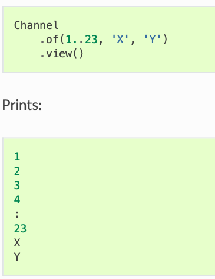
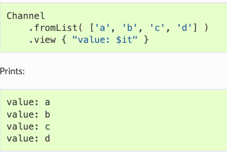
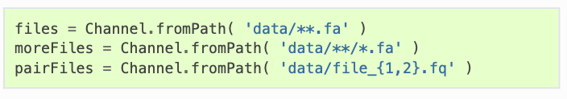
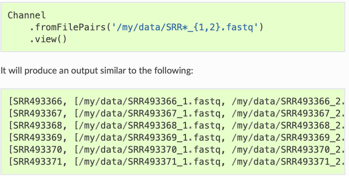
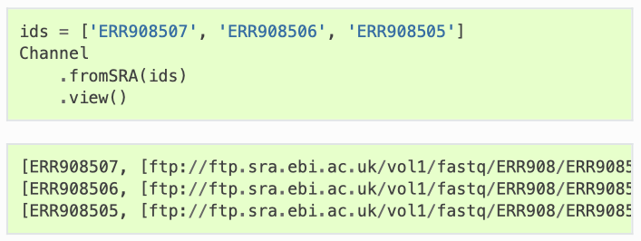

```{r share_again, echo=FALSE}
xaringanExtra::use_share_again()
```

```{r metathis, echo=FALSE}
library(metathis)
meta() %>%
  meta_name("github-repo" = "almeidasilvaf/Project_management") %>% 
  meta_social(
    title = "Project management in bioinformatics",
    description = paste(
      "Best practices for handling bioinformatics projects",
      "February 2021"
    ),
    url = "https://almeidasilvaf.github.io/Project_management/project_management.html",
    image = "https://almeidasilvaf.github.io/Project_management/cover.png",
    image_alt = paste(
      "Title slide of Project management in bioinformatics,", 
      "presented in February 2021 by Fabrício Almeida-Silva"
    ),
    og_type = "website",
    og_author = "Fabrício Almeida-Silva",
    twitter_card_type = "summary_large_image",
    twitter_creator = "@almeidasilvaf",
    twitter_site = "@almeidasilvaf"
  )
```

```{r setup, include=FALSE}
knitr::opts_chunk$set(
  echo = FALSE, warning = FALSE, message = FALSE,
  fig.width = 7, fig.height = 6, fig.align='center'
)
options(htmltools.dir.version = TRUE)
```

```{r extra}
xaringanExtra::use_panelset()
xaringanExtra::use_scribble()
xaringanExtra::use_tile_view()
```

background-image: url(figs/repro_crisis1.jpg)
background-position: 95% 50%

## The reproducibility crisis

<br />

.pull-left[
Many studies cannot be reproduced.


Some researchers cannot reproduce their own work.

.brand-charcoal[.font130[**Some of the reasons:**]]

- Different OS or system configurations

- Incomplete methods section

- Untested code

- Data and code not shared a.k.a. "Data available upon request"

]

---

<blockquote class="twitter-tweet tw-align-center"><p lang="es" dir="ltr">Bioinformatic pipelines<a href="https://t.co/bHxTpEql0W">pic.twitter.com/bHxTpEql0W</a></p>&mdash; Elin Videvall (@ElinVidevall) <a href="https://twitter.com/ElinVidevall/status/1382540865088917507?ref_src=twsrc%5Etfw">April 15, 2021</a></blockquote> <script async src="https://platform.twitter.com/widgets.js" charset="utf-8"></script>

---

background-image: url(figs/containers.png)
background-position: 80% 80%
background-size: 60%

## Nextflow pipelines
<br />
From the docs:

.blockquote[Nextflow enables scalable and reproducible scientific workflows using software containers. It allows the adaptation of pipelines written in the most common scripting languages.]

<br />

Nextflow's advantages:

- Portable

- Scalable

- Reproducible

---

## Running a pipeline (in a nutshell)

<br />

- Download Nextflow:

```{bash install, eval=FALSE, echo=TRUE}
wget -qO- https://get.nextflow.io | bash
```

**Hint**: move the `Nextflox` main executable to a directory in your $PATH.

- Write your pipeline code in a **.nf** file (*e.g.* `rnaseq_pipeline.nf`).

- Run the pipeline with:

```{bash run_nextflow, eval=FALSE, echo=TRUE}
nextflow run rnaseq.nf
```

---

## Processes and channels

<br />

A `Nextflow` pipeline is made of many joined **processes**.

A process can be written in any language (*e.g.* Bash, R, Python, Perl, etc.)

Processes are independent and communicate via asynchronous FIFO queues (**channels**)

Each **process** will use defined **channels** as *input* and *output*. 

---

background-image: url(figs/example_processes.png)
background-position: 95% 50%

## Example pipeline

.pull-left-1[
Example file: blast.nf

<br/ >

Configurations can be defined in a `nextflow.config` file:

- Environment variables

- Pipeline parameters

- Executor

- Memory allocated to each process

- ...
]

---

class: inverse, center, middle

# Nextflow as a language: data structures

---

## Variable definition

```{bash, echo=TRUE, eval=FALSE}
x = 7
println x

y = "Hello world"
print y
```

---

## Lists

Create list:

```{bash, echo=TRUE, eval=FALSE}
myList = [1776, -1, 33, 99, 0, 928734928763]
```

Access list elements (index 0):

```{bash, echo=TRUE, eval=FALSE}
println myList[0]
```

Get list length:

```{bash, echo=TRUE, eval=FALSE}
println myList.size()
```

---

## Maps

<br />

Analogous of *associative arrays* (e.g. Perl) and *dictionaries* (e.g. Python)

```{bash, echo=TRUE, eval=FALSE}
scores = [ "Hemanoel":99.9, "Dayana":100, "Francisnei":"absent"]
println scores["Hemanoel"]
```

---

background-image: url(figs/example_process.png)
background-position: 93% 50%
background-size: 40%

## Process structure

<br />

.pull-left-1[
**Directives:** optional settings that will affect the execution of the current process

**When:** condition to execute scripts
]

---

background-image: url(figs/align_example.png)
background-position: 95% 50%
background-size: 50%

## Conditional scripts

---

## Channels

.panelset[
.panel[.panel-name[of] <!-- start panel -->
.pull-left[
Creates a channel emitting a sequence of values
]
.pull-right[
```{r out.width=300}

```
]
] <!-- end panel -->

.panel[.panel-name[fromList] <!-- start panel -->
.pull-left[
Creates a channel emitting values in a list
]
.pull-right[
```{r out.width=600}

```
]
] <!-- end panel -->

.panel[.panel-name[fromPath] <!-- start panel -->
.pull-left[
Creates a channel emitting one or more file paths
]
.pull-right[
```{r out.width=700}

```
]
] <!-- end panel -->

.panel[.panel-name[fromFilePairs] <!-- start panel -->
.pull-left[
Creates a channel emitting the file pairs matching a glob pattern provided by the user
]
.pull-right[
```{r out.width=600}

```
]
] <!-- end panel -->

.panel[.panel-name[fromSRA] <!-- start panel -->
.pull-left-1[
Queries the NCBI SRA database and returns a channel emitting the FASTQ files matching the specified criteria (i.e. project or accession number)]
.pull-right-2[
```{r out.width=600}

```
]
] <!-- end panel -->

]

---

class: inverse, center, middle

# What if your pipeline already exists?

---

background-image: url(figs/nfcore.png)
background-position: 95% 30%

## nf-core

<br />

.pull-left-2[
A community effort to collect a curated set of analysis pipelines built using Nextflow.

Portable, well documented and trustworthy pipelines.

Available pipelines [here](https://nf-co.re/pipelines)
]

---

background-image: url(https://media.giphy.com/media/NEvPzZ8bd1V4Y/giphy.gif)
background-position: 50% 85%
background-size: 40%

## When you find a nf-core pipeline for what you want

---

background-image: url(figs/nf_community.png)
background-size: cover


---

class: sydney-yellow, middle, center

## Here's where you can find me:

`r icon::fontawesome("twitter")`  [@almeidasilvaf](https://twitter.com/almeidasilvaf)

`r icon::fontawesome("github")`  [almeidasilvaf](https://github.com/almeidasilvaf/)

`r icon::fontawesome("globe")`  [almeidasilvaf.github.io/home](https://almeidasilvaf.github.io/home/)

`r icon::fontawesome("envelope")`  [fabricio_almeidasilva@hotmail.com](mailto:fabricio_almeidasilva@hotmail.com)

`r icon::academicons("orcid")`  [Fabricio Almeida-Silva](https://orcid.org/0000-0002-5314-2964)

